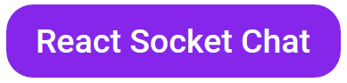

    

## Project - React Socket Chat

This repository contains two applications. One is a backend server that receives socket connections and handles events from a chat application. The other one is a web front-end that interacts with the user, sends and receives events from sockets. All this allows different users to have conversations in different rooms of this chat.

## Main Technologies

-  Server

   -  [Socket.io](https://socket.io)
   -  [Express.js](https://expressjs.com/pt-br/)
   -  [Typescript](https://www.typescriptlang.org/)
   -  [Node.js](https://nodejs.org/en/)

-  Web Front-End
   -  [React.js](https://reactjs.org/)
   -  [Socket.io Client](https://www.npmjs.com/package/socket.io-client)
   -  [Styled Componets](https://styled-components.com/)
   -  [Typescript](https://www.typescriptlang.org/)

## Run Project

-  Rename `.env.example` file to `.env`
-  To tun this project you need to have Node.js 14 or higher and yarn. If everything is right, you can run the project with the following commands.

1. In terminal, browse to the server folder
   -  `cd server`
2. Install server dependencies
   -  `yarn install`
3. Run the development server
   -  `yarn dev`
4. Open another terminal window and browse to the web-front-end folder
   -  `cd web-front-end`
5. Install web front-end dependencies
   -  `yarn install`
6. Run the front-end server
   -  `yarn start`

-  In a few seconds, the application will be available on `localhost:3000/`
